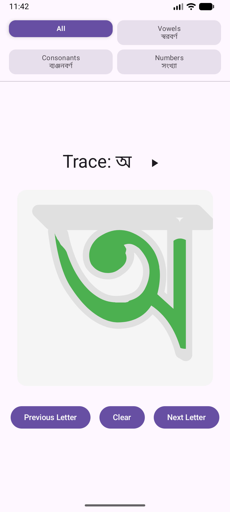
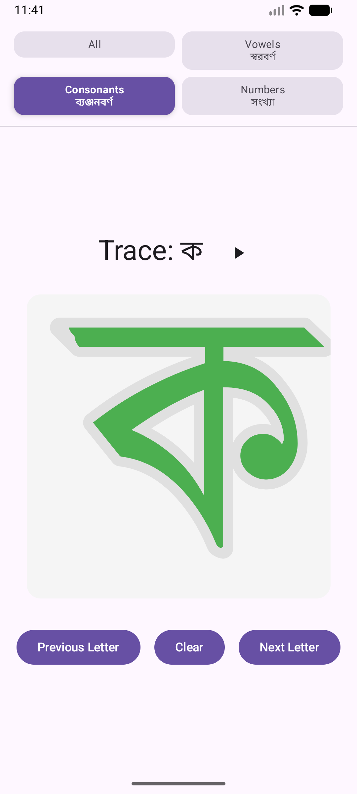
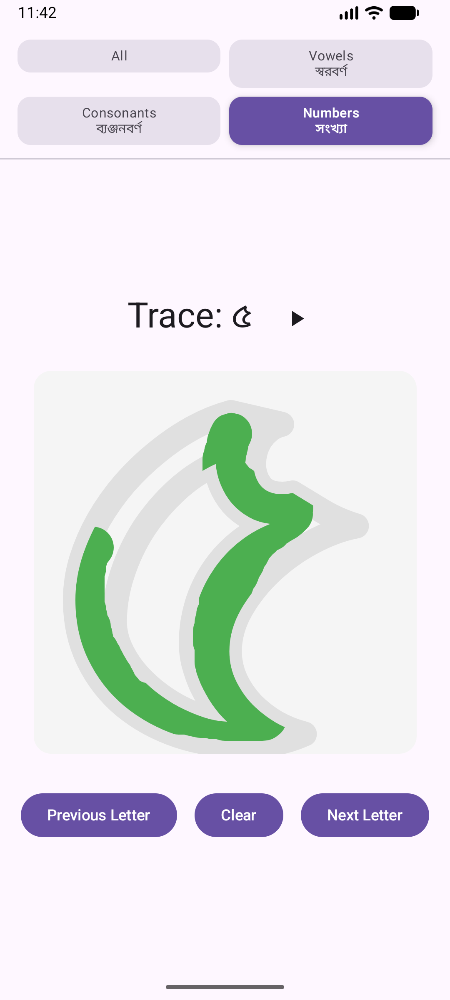

# Bengali Alphabet Tracing — বাংলা বর্ণমালা ট্রেসিং

An interactive ***Android app*** for learning to write the Bengali alphabet through guided tracing exercises, with audio pronunciation for every character and animated stroke guidance.

---

## Demo Video

- A short is available at: https://youtube.com/shorts/nPt05Z7ERsM.
- Google Play: //Working towards

---

## Features

### 📚 61 Bengali Characters
The app covers the complete Bengali writing system across four categories:

- **Vowels (স্বরবর্ণ)** — 11 vowel letters
- **Consonants (ব্যঞ্জনবর্ণ)** — 39 consonant letters
- **Numbers (সংখ্যা)** — Bengali numerals 0–10 (11 numerals)
- **All** — all 61 characters in sequence

---

<table>
  <tr>
    <td align="center"><b>Vowels (স্বরবর্ণ)</b></td>
    <td align="center"><b>Consonants (ব্যঞ্জনবর্ণ)</b></td>
    <td align="center"><b>Numbers (সংখ্যা)</b></td>
  </tr>
  <tr>
    <td></td>
    <td></td>
    <td></td>
  </tr>
</table>

---

### ✍️ Interactive Tracing Canvas
Trace each letter by drawing on the on-screen canvas with your finger:

- A **light grey outline** shows the correct letter shape as a guide.
- Your drawn stroke appears in **green** so you can compare it to the guide.
- Tap **Clear** to erase your attempt and try again.

---

### 🎬 Animated Stroke Guidance
Watch the correct writing motion play out step-by-step before you trace:

- Tap **▶ Watch** to start the animation.
- An **amber cursor** draws each stroke in the correct order at a readable pace (~900 ms per stroke).
- When a stroke finishes, it turns into a permanent **blue hint line** so you can keep it as a reference.
- Touch input on the canvas is disabled while the animation is running.
- Use **Previous Letter**, **Clear**, or **Next Letter** to stop the animation at any time.

---

### 💡 Stroke-by-Stroke Hints
Reveal guide strokes one at a time to scaffold your practice:

- Tap **Hint (n/total)** to reveal the next stroke as a **blue guide line**.
- The button label shows how many strokes have been revealed out of the total available.
- The Hint button is disabled once all strokes have been shown or while an animation is playing.
- Pressing **Clear** hides all hints so you can try unguided again.

---

### 🔊 Audio Pronunciation
Every character has a recorded MP3 pronunciation. Tap the **play button** next to the letter to hear it spoken aloud, reinforcing the connection between shape and sound.

---

### 🗂️ Category Selector
Filter the practice session to focus on a specific group:

| Category | Description |
|---|---|
| Vowels / স্বরবর্ণ | অ আ ই ঈ উ ঊ ঋ এ ঐ ও ঔ |
| Consonants / ব্যঞ্জনবর্ণ | ক খ গ ঘ ঙ … and more |
| Numbers / সংখ্যা | ০ ১ ২ ৩ ৪ ৫ ৬ ৭ ৮ ৯ ১০ |
| All | Complete set of 62 characters |

---

## How to Use

1. **Select a category** using the chips at the top of the screen.
2. **Read the letter** shown in the header.
3. **Tap the play button** to hear the pronunciation.
4. **Watch the animation** by tapping **▶ Watch** — the correct stroke order is drawn step-by-step with an amber cursor, leaving blue reference lines when done.
5. **Or use hints** by tapping **Hint (n/total)** to reveal one stroke at a time as a blue guide.
6. **Trace the letter** on the canvas by dragging your finger over the grey guide shape.
7. Tap **Clear** to erase your drawing and hints, then retry, or use **Next Letter / Previous Letter** to move to another character.

---

## Tech Stack

| Component | Technology |
|---|---|
| Language | Kotlin |
| UI | Jetpack Compose |
| Architecture | MVVM with ViewModel & StateFlow |
| Design | Material Design 3 |
| Audio | Android MediaPlayer |

